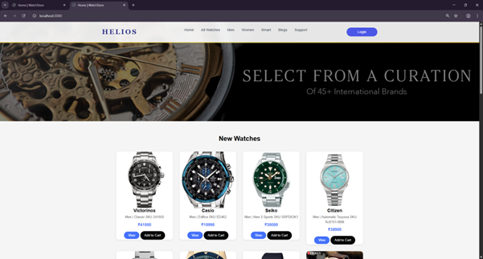
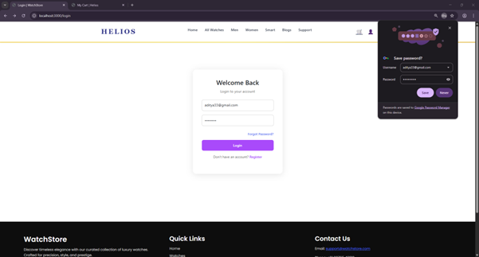
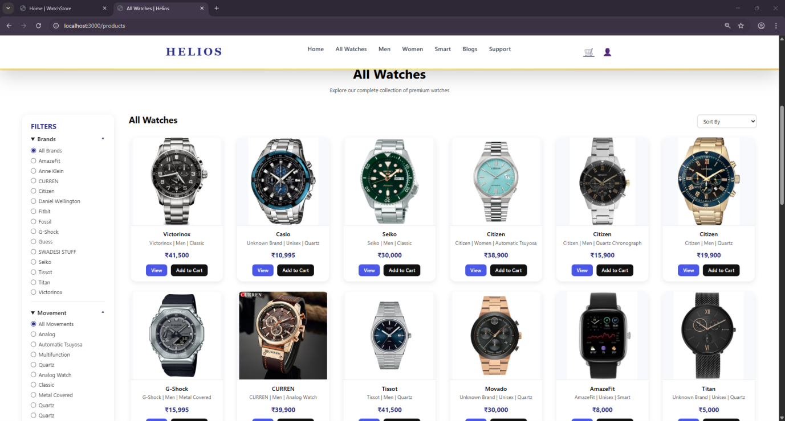
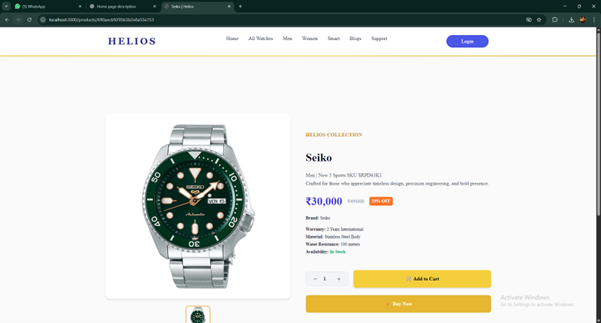
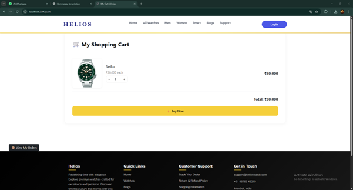
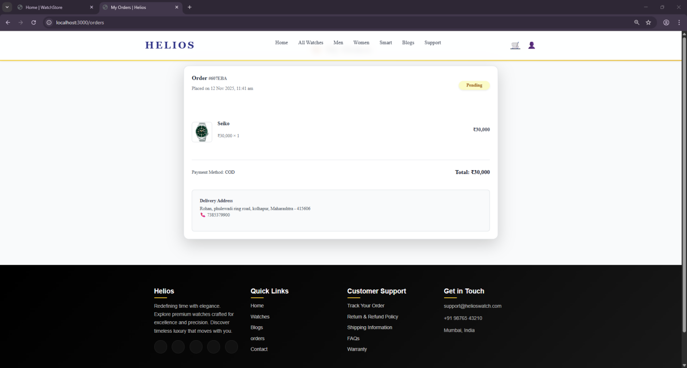

# Helios Watch Store

Helios Watch Store is a full-stack e-commerce web application for browsing and purchasing premium watches.  
It supports user authentication, cart management, role-based admin access, and online payments.

This project demonstrates practical backend development using Node.js, Express, MongoDB, and session-based authentication.

---

## Features

## 📸 Website Screenshots

### Home Page


### Login & Register


### Product Listing


### Product Details


### Cart & Checkout




### User
- User registration and login
- Session-based authentication
- Browse featured and all products
- Add/remove products from cart
- View cart total
- User account page
- Forgot password page

### Admin
- Admin login
- Role-based access control
- Admin dashboard
- Add new products with image upload
- Manage products

### General
- MongoDB database integration
- EJS templating engine
- File upload using Multer
- Modular route structure
- Clean MVC-style organization

---

## Tech Stack

**Frontend**
- EJS
- HTML
- CSS
- JavaScript

**Backend**
- Node.js
- Express.js

**Database**
- MongoDB (Mongoose)

**Authentication & Utilities**
- express-session
- body-parser
- multer

---

## Project Structure

```txt
helios-watch-store/
│── middlewares/
│── models/
│── public/
│── routes/
│── src/
│── utils/
│── views/
│── .gitignore
│── package.json
│── package-lock.json
│── server.js
│── seed.js
````

---

## Environment Variables

Create a `.env` file in the root directory:

```env
PORT=3000
MONGO_URI=mongodb://127.0.0.1:27017/watchstore
SESSION_SECRET=yourSecretKey
```

Note: `.env` is intentionally ignored in GitHub for security.

---

## Installation & Setup

1. Clone the repository

```bash
git clone https://github.com/your-username/helios-watch-store.git
cd helios-watch-store
```

2. Install dependencies

```bash
npm install
```

3. Start MongoDB (local or Atlas)

4. Run the server

```bash
npm start
```

5. Open in browser

```
http://localhost:3000
```

---

## Authentication Flow

* Users log in using email and password
* Session data is stored using express-session
* Admin access is protected using middleware
* Logged-in user and cart are available globally in all views

---

## Security Notes

* Sensitive data is stored in environment variables
* `.env` and `node_modules` are excluded using `.gitignore`
* Admin routes are protected using role-based middleware

---

## Future Enhancements

* Password hashing with bcrypt
* Online payment gateway integration
* Order history and tracking
* Product reviews and ratings
* Deployment on cloud platform

---

## Author

Rohan Mahantesh Hiremathswami
BCA Graduate | Full-Stack Developer | Aspiring AI Engineer


